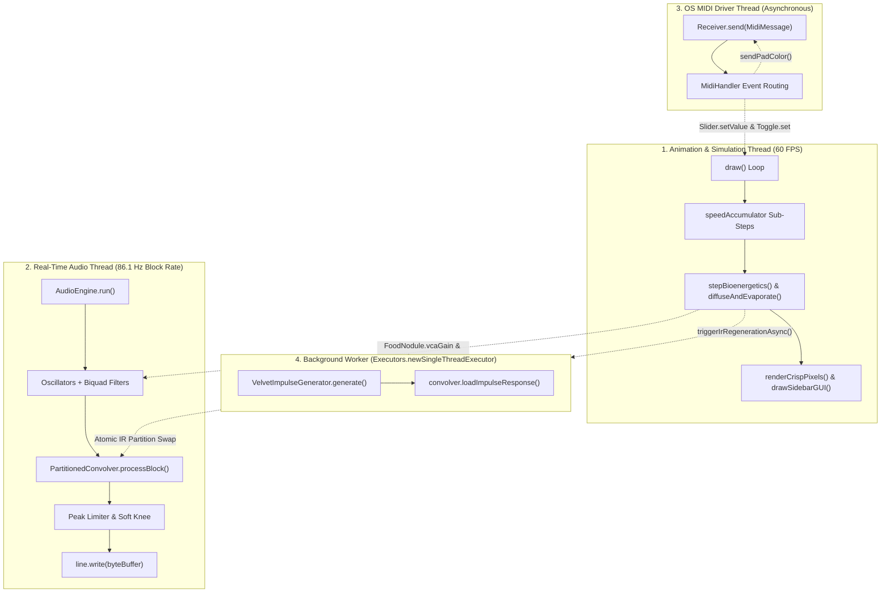

# Software Architecture & Concurrency Model

This document outlines the software design, thread hierarchy, data flow, and memory safety models implemented in `MOLD`.

---

## 1. Concurrency Model & Thread Hierarchy

`MOLD` operates across four asynchronous execution contexts to guarantee low-latency audio streaming, high-throughput simulation, and responsive user interaction without blocking or priority inversion:



### Thread Specifications

| Context | Thread Class | Frequency / Trigger | Primary Responsibilities |
|:---|:---|:---|:---|
| **Animation / Simulation** | Processing Main Thread | $60\text{ Hz}$ | Bioenergetics Euler steps, trail diffusion, pixel rendering, GUI dispatch. |
| **Real-Time Audio** | `AudioEngine extends Thread` | $\approx 86.1\text{ Hz}$ ($512\text{ samples}$) | Oscillator DSP, biquad filtering, UP-OLA convolution, master limiting. |
| **Hardware MIDI** | Java Sound OS Callback | Asynchronous | Processing incoming CC fader/knob packets and note presses; driving LEDs. |
| **Impulse Worker** | `irExecutor` (`SingleThreadExecutor`) | On parameter change / Mitosis | Synthesizing sparse velvet impulse responses without blocking audio or visuals. |

---

## 2. Thread Safety & Lock-Free Data Sharing

Real-time audio threads must never block on mutexes, acquire heavy monitors, or trigger heap allocations. Cross-thread communication uses strict lock-free and thread-safe idioms:

### 1. Volatile Scalar Control
All shared parameters (`simSpeed`, `isPaused`, `audioEnabled`, `reverbWet`, `reverbDry`, `waveformIdx`, `vcaGain`, `frequency`) are declared `volatile`. This ensures immediate cross-thread cache coherency without requiring synchronization primitives.

### 2. Lock-Free Entity Management (`CopyOnWriteArrayList`)
Food nodules are stored in a `CopyOnWriteArrayList<FoodNodule>`:
- The **simulation thread** modifies the list when food is placed, scattered, or completely consumed.
- The **audio thread** reads the list every $11.6\text{ ms}$ using indexed access (`for (int v = 0; v < foodNodes.size(); v++)`).
- A localized `try { ... } catch (IndexOutOfBoundsException e) { break; }` guard provides atomic immunity if an element is removed mid-buffer by the simulation thread, entirely preventing audio thread crashes.

### 3. Atomic Partition Swapping in PartitionedConvolver
When a new impulse response is synthesized in the background:
- `PartitionedConvolver.loadImpulseResponse()` partitions the IR and performs FFT transformations entirely outside the audio thread.
- A concise `synchronized (lock)` block swaps the pre-allocated pointers (`irPartitionsRealL`, `inputHistoryReal`, etc.) atomically within microseconds, avoiding any dropouts or glitching.

---

## 3. Modular File Architecture

The codebase is organized into modular files within the sketch folder:

```
MOLD/
├── MOLD.pde            # Core orchestrator: setup(), draw(), layout calculations, and exit cleanup.
├── Simulation.pde      # Biological core: agent arrays, 3-sensor chemotaxis, diffusion convolution.
├── FoodNodule.pde      # Food entity: nutrient assimilation, radius scaling, audio state.
├── Harmony.pde         # Musical tuning: 8x8 pitch cache, modal/just intonation intervals.
├── Render.pde          # Visual presentation: crisp pixel buffers, Zorn color transitions, GUI header.
├── Controls.pde        # Interaction: UI widget tree, action triggers, mouse & keyboard events.
├── UI.pde              # GUI toolkit: lightweight immediate-mode widgets (Slider, Toggle, Row, Dropdown).
├── Midi.pde            # Controller layer: Launchpad RGB flush and MIDImix fader/button mapping.
├── Audio.pde           # Sonic engine: PCM streaming thread, biquad filters, dynamics limiter.
├── FastFFT.java        # DSP primitive: In-place radix-2 Cooley-Tukey FFT & IFFT.
├── PartitionedConvolver.java # DSP engine: Real-time UP-OLA frequency-domain block convolver.
└── VelvetImpulseGenerator.java # DSP synthesizer: Parametric logarithmic velvet-noise IR generator.
```

---

## 4. Performance & Memory Profile

- **Zero Garbage Collection Churn in Audio Loop:** Pre-allocated byte buffers, float arrays, and FFT workspaces eliminate heap allocation inside the audio streaming loop.
- **Data-Oriented Simulation Arrays:** Slime mold agents are stored in contiguous primitive parallel arrays (`agentX[]`, `agentY[]`, `agentHeading[]`, `agentEnergy[]`), maximizing CPU cache locality and enabling smooth 60 FPS performance with 25,000 agents.
- **Fast Mathematical Approximations:** Padé rational polynomial replacements for `Math.tanh()` and a bitwise lookup table for `Math.sin()` reduce per-sample DSP overhead by $>90\%$.
