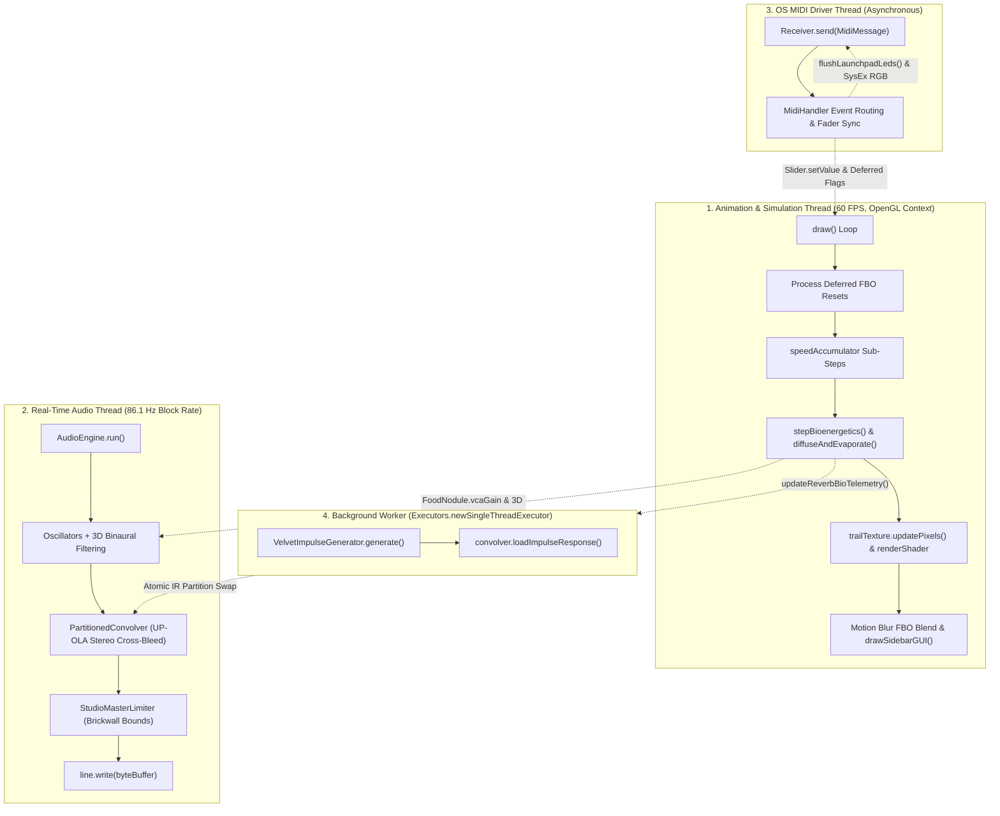

# Software Architecture & Concurrency Model

This document outlines the software design, thread hierarchy, data flow, and memory safety models implemented in `MOLD`.

---

## 1. Concurrency Model & Thread Hierarchy

`MOLD` operates across four asynchronous execution contexts to guarantee low-latency audio streaming, high-throughput simulation, and responsive user interaction without blocking or priority inversion:



### Thread Specifications

| Context | Thread Class | Frequency / Trigger | Primary Responsibilities |
|:---|:---|:---|:---|
| **Animation / Simulation** | Processing Main Thread (JOGL) | $60\text{ Hz}$ | Bioenergetics Euler steps, trail diffusion, texture streaming, GLSL shader evaluation, motion blur FBO blending, GUI dispatch. |
| **Real-Time Audio** | `AudioEngine extends Thread` | $\approx 86.1\text{ Hz}$ ($512\text{ samples}$) | Oscillator DSP, biquad lowpass, 3D inter-aural time/intensity panning, head-shadow filters, UP-OLA stereo convolution, master limiting. |
| **Hardware MIDI** | Java Sound OS Callback | Asynchronous | Processing incoming CC fader/knob packets and note presses; driving Launchpad LEDs and SysEx RGB packets. |
| **Impulse Worker** | `irExecutor` (`SingleThreadExecutor`) | On parameter change / Mitosis boom | Synthesizing sparse velvet impulse responses without blocking audio streaming or visuals. |

---

## 2. Thread Safety & Lock-Free Data Sharing

Real-time audio threads and asynchronous event loops must strictly adhere to concurrency boundaries to avoid priority inversion, heap churn, or native JVM OpenGL deadlocks:

### 1. Volatile Scalar Control
All shared parameters (`simSpeed`, `isPaused`, `audioEnabled`, `reverbWet`, `reverbDry`, `reverbBioModDepth`, `waveformIdx`, `vcaGain`, `frequency`) are declared `volatile`. This ensures immediate cross-thread cache coherency without requiring synchronization primitives.

### 2. Lock-Free Entity Management (`CopyOnWriteArrayList`)
Food nodules are stored in a `CopyOnWriteArrayList<FoodNodule>`:
- The **simulation thread** modifies the list when food is placed, scattered, or completely consumed.
- The **audio thread** reads the list every $11.6\text{ ms}$ using indexed access (`for (int v = 0; v < foodNodes.size(); v++)`).
- A localized `try { ... } catch (IndexOutOfBoundsException e) { break; }` guard provides atomic immunity if an element is removed mid-buffer by the simulation thread, entirely preventing audio thread crashes.

### 3. Atomic Partition Swapping in PartitionedConvolver
When a new impulse response is synthesized in the background:
- `PartitionedConvolver.loadImpulseResponse()` partitions the IR and performs FFT transformations entirely outside the audio thread.
- A concise `synchronized (lock)` block swaps the pre-allocated partition pointers (`irPartitionsRealL`, `inputHistoryReal`, etc.) atomically within microseconds, avoiding any dropouts or glitching.

### 4. OpenGL Thread Affinity & Deferred Execution
In Processing 4 (JOGL), native OpenGL commands (`beginDraw()`, `endDraw()`, `background()`, `clear()`) are strictly thread-bound to the main rendering loop (`draw()`).
- Asynchronous callbacks (MIDI triggers, thread restarts, button handlers) mutate only CPU state and set thread-safe flags (such as `volatile boolean pendingReinoculateFboClear`).
- At the start of `draw()`, the rendering thread checks these flags and safely clears or reinitializes FBOs within the active graphics context, preventing fatal native JVM `SIGSEGV` crashes.
- Simulation diffusion runs on CPU arrays (`trailMap`, `nextTrailMap`), with display textures fed via `PImage.pixels` to avoid JOGL FBO texture cache invalidation.

---

## 3. Modular File Architecture

The codebase is organized into modular files within the sketch folder:

```
MOLD/
├── MOLD.pde            # Core orchestrator: setup(), draw(), layout calculations, window configuration, and exit cleanup.
├── Simulation.pde      # Biological core: agent arrays, 3-sensor chemotaxis, diffusion convolution, fast trigonometric LUT.
├── FoodNodule.pde      # Food entity: nutrient assimilation, radius scaling, 3D spatial panning & elevation parameters.
├── Harmony.pde         # Musical tuning: 8x8 pitch cache, modal/just intonation intervals, octave transpose logic.
├── Render.pde          # Visual presentation: PImage texture streaming, GLSL shader passes, motion blur FBOs, 3D listener overlay.
├── Controls.pde        # Interaction: UI widget tree, action triggers, mouse & keyboard events, canvas coordinate mappings.
├── UI.pde              # GUI toolkit: lightweight immediate-mode widgets (Slider, Toggle, Row, Dropdown, Section).
├── Midi.pde            # Controller layer: Launchpad RGB flush, quadrant note decoders, radial ripples, and MIDImix fader/button mapping.
├── Audio.pde           # Sonic engine: PCM streaming thread, biquad filters, 3D binaural spatialization, reverb telemetry.
├── FastFFT.java        # DSP primitive: In-place radix-2 Cooley-Tukey FFT & IFFT (zero heap allocation).
├── PartitionedConvolver.java # DSP engine: Real-time UP-OLA frequency-domain block convolver with true stereo cross-bleed.
├── VelvetImpulseGenerator.java # DSP synthesizer: Parametric logarithmic velvet-noise IR generator.
└── data/render.glsl    # Hardware fragment shader: procedural sigmoid sharpness curves and palette color ramps.
```

---

## 4. Performance & Memory Profile

- **Zero Garbage Collection Churn in Audio Loop:** Pre-allocated byte buffers, float arrays, and FFT workspaces eliminate heap allocation inside the audio streaming loop.
- **Data-Oriented Simulation Arrays:** Slime mold agents are stored in contiguous primitive parallel arrays (`agentX[]`, `agentY[]`, `agentHeading[]`, `agentEnergy[]`), maximizing CPU cache locality and enabling smooth 60 FPS performance with up to 64,000 agents.
- **Fast Mathematical Approximations:** A 4096-entry precomputed trigonometric sine lookup table (`SIN_LUT`), Xorshift32 PRNG (`simRand`), Padé rational polynomial replacements for `Math.tanh()`, and bitwise lookup tables reduce simulation and DSP cycle overhead by $>85\%$.
- **Decoupled Control & Audio Rates:** Expensive trigonometric and coefficient calculations execute at the block rate (~86.1 Hz) or frame rate (60 Hz), keeping the per-sample inner loop streaming pure audio without coefficient updates.
