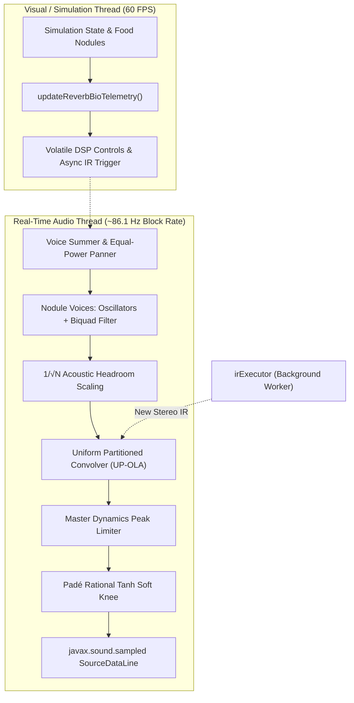
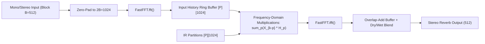

# Audio Engine: Synthesis, Velvet Convolver & Bio-Sonification

This document details the real-time audio synthesis pipeline, DSP algorithms, filter equations, and biometric audio modulation architecture implemented in `MOLD`.

---

## 1. System Overview & Audio Threading

The audio engine runs on a dedicated high-priority background thread (`AudioEngine extends Thread`) isolated from Processing's 60 FPS animation loop. Communication between the simulation and the audio thread occurs exclusively via thread-safe lock-free primitives (`volatile` scalars and thread-safe data structures).

### Real-Time Specs & Constraints

- **Sample Rate ($f_s$):** $44{,}100\text{ Hz}$
- **Format:** 16-bit Signed PCM Little-Endian Stereo (2 channels)
- **Audio Block Size ($B$):** $512\text{ samples}$
- **Block Latency:** $T_{\text{block}} = \frac{512}{44100} \approx 11.61\text{ ms}$
- **Zero Heap Allocations:** All sample arrays, FFT workspaces, and accumulation buffers are pre-allocated during initialization. Zero objects are instantiated inside `run()` or `processBlock()`, completely preventing JVM Garbage Collection stalls.

---

## 2. 8×8 Spatial Pitch Mapping & Tuning Matrices

Each food nodule's fundamental frequency is determined by its position on an $8 \times 8$ grid over the canvas ($c \in [0, 7]$, $r \in [0, 7]$):

$$r_{\text{inv}} = 7 - r, \quad \text{octave} = \text{baseOctave} + \lfloor r_{\text{inv}} / 2 \rfloor$$

If $r_{\text{inv}}$ is odd, an intermediate sub-octave scalar ($1.5$) is applied to double melodic density.

### Tuning Systems

1. **Equal Temperament Modes (Major/Minor Pentatonic, Lydian, Dorian, Hirajoshi):**
   Given scale degree semitone offset $S(c)$ and root pitch index $K_{\text{root}} \in [0, 11]$:
   $$\text{semitone}_{\text{total}} = (\text{octave} \cdot 12) + K_{\text{root}} + S(c)$$
   $$f = 440.0 \cdot 2^{\frac{\text{semitone}_{\text{total}} - 57}{12}} \cdot \text{subOffset}$$

2. **Just Intonation:**
   Uses pure integer frequency ratios relative to fundamental root pitch:
   $$R \in \left\{ 1.0, \; \frac{9}{8}, \; \frac{5}{4}, \; \frac{11}{8}, \; \frac{3}{2}, \; \frac{13}{8}, \; \frac{7}{4}, \; 2.0 \right\}$$
   $$f = 55.0 \cdot 2^{\text{octave} - 1} \cdot 2^{K_{\text{root}} / 12} \cdot R(c) \cdot \text{subOffset}$$

---

## 3. Voice Synthesis & Filter Architecture

Each active food nodule acts as an autonomous monophonic synthesizer voice:

### Oscillators & Fast Sine LUT

The oscillator phase advances by $\Delta \phi = f / f_s$ per sample. Supported waveforms:
- **Triangle:** $\text{raw} = (\phi < 0.5) \;?\; (4\phi - 1) : (3 - 4\phi)$
- **Sine:** Pre-computed 4096-entry lookup table with bitwise wrap:
  $$\text{idx} = \lfloor \phi \cdot 4096 \rfloor \;\&\; 4095, \quad \text{raw} = \text{sineTable}[\text{idx}]$$
- **Sawtooth:** $\text{raw} = 2\phi - 1$
- **Square:** $\text{raw} = (\phi < 0.5) \;?\; 0.8 : -0.8$

### Dynamic Resonant Biquad Low-Pass Filter

The voice signal passes through a direct-form II Biquad low-pass filter (Robert Bristow-Johnson Cookbook):

$$\begin{aligned}
\omega_0 &= \frac{2\pi f_c}{f_s}, \quad \alpha = \frac{\sin(\omega_0)}{2Q} \\
b_0 &= \frac{1 - \cos(\omega_0)}{2(1 + \alpha)}, \quad b_1 = \frac{1 - \cos(\omega_0)}{1 + \alpha}, \quad b_2 = b_0 \\
a_1 &= \frac{-2\cos(\omega_0)}{1 + \alpha}, \quad a_2 = \frac{1 - \alpha}{1 + \alpha}
\end{aligned}$$

#### Non-Linear Cutoff Sweep
As nutrients deplete ($\rho = N / N_0$), the cutoff sweeps downwards from $3200\text{ Hz}$ to $80\text{ Hz}$:
$$f_c = f_{\text{base}} + (f_{\max} - f_{\text{base}}) \cdot \rho^{1.8 \cdot \text{sens}}$$

### Moore-Neighborhood VCA Modulation

The voice output is amplified by a Voltage Controlled Amplifier (VCA) driven by the surrounding biological mass. 
The 8 Moore neighbors surrounding the nodule's cell are summed to calculate $\text{adjacentMass}$:
$$\text{effectiveMass} = \max(0, \; \text{adjacentMass} - \text{gateThreshold})$$
$$\text{drive} = \frac{\text{effectiveMass} \cdot \text{vcaSensitivity} \cdot 1.25}{1000.0}$$
$$\text{targetGain} = \text{isBeingEaten} \;?\; \tanh(\text{drive}) : 0.0$$

The gain is smoothed through a single-pole low-pass filter to prevent clicks:
$$G_{t} = G_{t-1} + (\text{targetGain} - G_{t-1}) \cdot 0.15$$

---

## 4. Multi-Voice Headroom & Equal-Power Panning

### Equal-Power Stereo Panning

Voices are panned across the stereo field according to horizontal canvas coordinate $x \in [0, W]$:
$$\theta_{\text{pan}} = \text{constrain}\left(\frac{x}{W}, \; 0.05, \; 0.95\right) \cdot \frac{\pi}{2}$$
$$g_L = \cos(\theta_{\text{pan}}), \quad g_R = \sin(\theta_{\text{pan}})$$

### Acoustic Summer Headroom Scaling

To prevent multi-voice accumulation clipping, the sub-mix is scaled proportionally by the square root of active voices $V_{\text{active}}$:
$$S_{\text{voice}} = \frac{0.24}{\sqrt{\max(1.0, \; 0.75 \cdot V_{\text{active}})}}$$

---

## 5. Velvet Noise Algorithmic Convolver (UP-OLA)

Reverberation is implemented via real-time partitioned convolution with a parametrically synthesized stereo velvet-noise impulse response.

### Velvet Impulse Response Generation

Velvet noise synthesizes sparse, pseudo-random sequences of unit impulses ($+1$ and $-1$) whose temporal density increases logarithmically from early reflections ($D_0 = 2000\text{ pulses/s}$) to dense late diffuse field ($D_{\max} = 10000\text{ pulses/s}$):

1. **Grid Interval:** At time $t$, average pulse spacing is $T_d(t) = \frac{f_s}{D(t)}$.
2. **Pulse Position & Sign:** Pulse sample $m_k = \lfloor k \cdot T_d + \mathcal{U}(0, T_d - 1) \rfloor$, sign $s_k \in \{-1, +1\}$.
3. **Decay Envelope:** Energy decays exponentially based on $T_{60}$:
   $$E(t) = 10^{-3 \cdot t / T_{60}}$$
4. **Spectral Absorption Filter:** Single-pole low-pass filter simulates air and wall absorption:
   $$y[n] = (1 - \alpha) x[n] + \alpha y[n-1]$$
5. **Stereo Decorrelation:** Left and right impulse trains use independent pseudorandom seeds, achieving normalized cross-correlation $\rho_{LR} < 0.01$.

### Uniform Partitioned Overlap-Add (UP-OLA)

- **Block Size $B = 512$**, **FFT Size $2B = 1024$**.
- An impulse response of length $L$ is sliced into $P = \lceil L / B \rceil$ uniform partitions $h_p[n]$ ($0 \le p < P$), zero-padded to $2B$, and transformed into frequency domain slices $H_p[k]$.
- Input audio is buffered into blocks of size $B$, zero-padded to $2B$, transformed to $X_m[k]$, and stored in a circular history delay buffer.
- Spectral accumulation computes the circular convolution:
  $$Y_m[k] = \sum_{p=0}^{P-1} X_{m-p}[k] \cdot H_p[k]$$
- Two inverse FFTs (Left and Right) yield the time-domain signal, which is overlap-added with the previous tail buffer.

---

## 6. Bio-Sonification Telemetry Routing

The slime mold's macroscopic colony states dynamically modulate the acoustic reverberator:

| Biological Macro-Metric | Reverb Parameter | Transfer Function | Musical Character |
|:---|:---|:---|:---|
| **Colony Biomass** ($\sum E_{\text{cell}}$) | **Wet / Dry Mix** | $\text{Wet} = 0.8 \cdot \tanh\left(\frac{\text{Biomass}}{10000}\right)$ $\text{Dry} = 1.0 - 0.4 \cdot \text{Wet}$ | Small colony is dry and intimate; massive colony immerses the space in lush ambient reverb. |
| **Locomotion Cost** | **High Damping** ($\alpha_{\text{damp}}$) | $\alpha = \text{constrain}\left(0.2 + 0.6 \cdot \frac{\text{Cost}}{0.1}, 0.05, 0.95\right)$ | Rapid exploration darkens the acoustic reflections. |
| **Tendril Reach** ($d_s$) | **Pre-Delay** ($t_{\text{pre}}$) | $t_{\text{pre}} = 5\text{ms} + \left(\frac{d_s}{45\text{px}}\right) \cdot 40\text{ms}$ | Extended arterial reach delays first reflections, expanding perceived room size. |
| **Colony Mass Doubling** | **Impulse Reseed** | Triggers asynchronous background IR rebuild | Mitosis bursts inject distinct spatial reflections without halting audio playback. |

---

## 7. Master Dynamics Limiter & Padé Soft Knee

To protect against unexpected output spikes, the master bus routes through a studio dynamics limiter followed by a mathematical brickwall soft-knee ceiling:

### Envelope Follower
$$\text{absSample} = \max(|L|, |R|)$$
$$\text{env}_{t} = (\text{absSample} > \text{env}_{t-1}) \;?\; (\alpha_{\text{att}} \text{env} + (1-\alpha_{\text{att}})\text{absSample}) : (\alpha_{\text{rel}} \text{env} + (1-\alpha_{\text{rel}})\text{absSample})$$
*(Attack: $2\text{ ms}$, Release: $100\text{ ms}$)*

### Fast-Acting Limiter
$$\text{Gain}_{\text{limiter}} = (\text{env} > 0.75) \;?\; \frac{0.75}{\text{env}} : 1.0$$

### Padé Rational Tanh Approximation Soft Knee
To avoid expensive `Math.tanh()` calls ($88{,}000+$ per second), we evaluate a 4-multiplication Padé rational approximation:
$$\text{fastTanh}(x) = \begin{cases} -1.0 & x < -3.0 \\ 1.0 & x > 3.0 \\ x \cdot \frac{27 + x^2}{27 + 9x^2} & \text{otherwise} \end{cases}$$

Signals exceeding $0.85$ are gently curved below $0.98$:
$$\text{softKnee}(v) = (v > 0.85) \;?\; 0.85 + 0.13 \cdot \text{fastTanh}\left(\frac{v - 0.85}{0.13}\right) : \dots$$
Guarantees clean, zero-clipping 16-bit integer conversion without CPU stalls.
