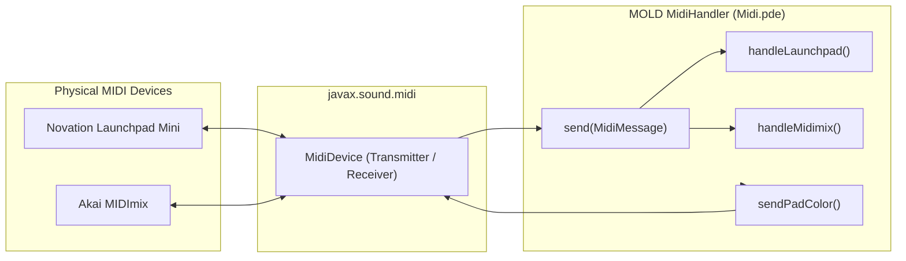

# Hardware MIDI Controller Integration

This document specifies the MIDI protocol implementation, device discovery scoring, hardware control mapping, and bi-directional LED telemetry for the **Novation Launchpad Mini [MK3]** and **Akai MIDImix** in `MOLD`.

---

## 1. System Architecture & Device Discovery

MIDI communication is implemented via standard Java Sound (`javax.sound.midi`) without external native wrappers. The `MidiHandler` class implements `Receiver` to process incoming control messages asynchronously and maintain output connections to drive hardware LEDs.



### Automatic Port Scoring

On startup and during rescan, all connected MIDI devices are scored:
- **Akai MIDImix:** Assigned highest priority (score `10`).
- **Launchpad Mini [MK3]:** Scored `2` (prefers the standard `MIDI` port over the `DAW` virtual port).
- The detected device name sets internal routing flags (`inputIsMidimix`, `outputIsMidimix`), cleanly separating note definitions and preventing message collisions.

---

## 2. Novation Launchpad Mini [MK3]

### Programmer Mode Initialization

When the hardware link is activated, the application sends a manufacturer SysEx message to switch the Launchpad into **Programmer Mode**:

```
0xF0 0x00 0x20 0x29 0x02 0x0D 0x0E 0x01 0xF7
```

On exit or disconnect, the device is restored to default mode with `0x00` in the mode byte.

### 8×8 Grid Note Addressing

Pads on the Launchpad's $8 \times 8$ grid map to decimal note numbers where row $r \in [0, 7]$ (top to bottom) and column $c \in [0, 7]$ (left to right):

$$\text{note} = (8 - r) \cdot 10 + (c + 1)$$

*Example:* Top-left pad is Note `81`; bottom-right pad is Note `18`.

Pressing any grid pad spawns a new oat food nodule on the corresponding canvas cell with randomized sub-pixel jitter.

### Hardware LED Feedback & Zorn Palette

To prevent flooding the USB-MIDI bus, a 64-byte array `padDirtyStates[64]` caches current pad colors. Updates are rate-limited to $\approx 22\text{ Hz}$ ($45\text{ ms}$ interval), transmitting only when a cell state changes.

Pads are illuminated using Novation's velocity color palette, mapped to the Zorn aesthetic:

| Grid Feature | State | Velocity Code | Hardware Color |
|:---|:---|:---|:---|
| **Food Nodule** | Idle (not being eaten) | `3` | Solid White |
| **Food Nodule** | Fresh / High Nutrient ($>65\%$) | `5` | Vermilion Red |
| **Food Nodule** | Mid Nutrient ($35\% - 65\%$) | `9` | Warm Orange |
| **Food Nodule** | Depleting ($<35\%$) | `13` | Yellow |
| **Slime Mold Colony** | Heavy Biomass ($>450\text{ u}$) | `13` | Bright Yellow |
| **Slime Mold Colony** | Medium Biomass ($>200\text{ u}$) | `15` | Soft Yellow |
| **Slime Mold Colony** | Active Margin ($>80\text{ u}$) | `62` | Warm Ochre |
| **Slime Mold Colony** | Exploratory Vein ($>25\text{ u}$) | `84` | Faint Amber |
| **Empty Substrate** | No mass / no food | `0` | LED Off |

---

## 3. Akai MIDImix

The Akai MIDImix provides physical tactile control over synthesis, dynamics, and simulation settings.

### Faders (Audio & Master Controls)

All faders transmit MIDI Continuous Controller (CC) messages on Channel 1 ($0\text{–}127$):

| Physical Control | MIDI CC (Dec) | MIDI CC (Hex) | Controlled Parameter | Value Range |
|:---|:---|:---|:---|:---|
| **Fader Track 1** | `19` | `0x13` | Filter Cutoff Sensitivity | `0.2x – 3.0x` |
| **Fader Track 2** | `23` | `0x17` | Filter Resonance (Q) | `0.5 – 18.0` |
| **Fader Track 3** | `27` | `0x1B` | Adjacent Mass VCA Gain | `0.2x – 3.0x` |
| **Fader Track 4** | `28` | `0x1C` | Reverb Wet Mix | `0.0 – 1.0` |
| **Fader Track 5** | `29` | `0x1D` | Reverb Dry Mix | `0.0 – 1.0` |
| **Fader Track 6** | `30` | `0x1E` | Reverb Decay Time ($T_{60}$) | `0.5s – 8.0s` |
| **Fader Track 7** | `31` | `0x1F` | Reverb High Damping ($\alpha$) | `0.05 – 0.95` |
| **Fader Track 8** | `33` | `0x21` | Reverb Pre-Delay | `5ms – 60ms` |
| **Master Fader** | `11` | `0x0B` | Simulation Speed | `0.05x – 2.00x` |

### Track 1 Rotary Knobs (Bioenergetics)

| Knob Position | MIDI CC | Controlled Parameter | Range |
|:---|:---|:---|:---|
| **Top Knob** | `16` (`0x10`) | Tendril Reach (Sensor Distance) | `6.0 – 45.0 px` |
| **Middle Knob** | `20` (`0x14`) | Basal Metabolic Rate (BMR) | `0.001 – 0.050` |
| **Bottom Knob** | `24` (`0x18`) | Exploration Locomotion Cost | `0.002 – 0.080` |

### Buttons & Bi-Directional LED Synchronization

The MIDImix features internal amber LEDs behind the **Mute** (Row 1) and **Rec Arm** (Row 2) buttons. The hardware contains **no local hardware toggle logic**; LEDs must be explicitly addressed by the host software.

#### Protocol
- **Turn LED ON:** Transmit `Note On` on Channel 1 with Velocity `127` (`0x7F`).
- **Turn LED OFF:** Transmit `Note On` on Channel 1 with Velocity `0` (`0x00`).
  *(Note: Standard `Note Off` status bytes `0x80` are ignored by MIDImix firmware).*

#### Row 1: Mute Buttons (Application State Toggles)
Each button toggles a boolean state. The software immediately replies with an LED update matching the current state:

| Strip | Note (Dec) | Action / Toggle Target | LED State Behavior |
|:---|:---|:---|:---|
| Track 1 | `1` | Pause / Resume Simulation | Lit when paused (`isPaused = true`) |
| Track 2 | `4` | Master Audio Killswitch | Lit when audio is active (`audioEnabled = true`) |
| Track 3 | `7` | Fullscreen Mode Toggle | Lit when in fullscreen mode |
| Track 4 | `10` | 8×8 Harmonic Grid Overlay | Lit when grid overlay is visible |
| Track 5 | `13` | Reverb Processor Bypass | Lit when reverb is enabled |
| Track 6 | `16` | Bio-Sonification Telemetry | Lit when biometric auto-modulation is active |

#### Row 2: Rec Arm Buttons (Momentary Actions)
These buttons trigger single actions on press. Their LEDs illuminate while physically held down and extinguish upon release:

| Strip | Note (Dec) | Momentary Trigger Function |
|:---|:---|:---|
| Track 1 | `3` | Scatter 4 New Oat Food Nodules |
| Track 2 | `6` | Clear All Food Nodules (Silence Voices) |
| Track 3 | `9` | Re-Inoculate Central Slime Colony |
| Track 4 | `12` | Rescan Connected MIDI Devices |
| Track 5 | `15` | Regenerate Reverb Impulse Response Seed |
