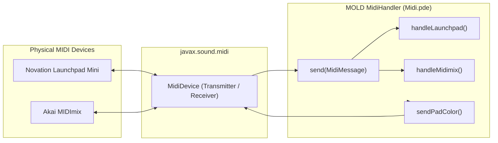

# Hardware MIDI Controller Integration

This document specifies the MIDI protocol implementation, device discovery scoring, hardware control mapping, and bi-directional LED telemetry for the **Novation Launchpad Mini [MK3]** and **Akai MIDImix** in `MOLD`.

---

## 1. System Architecture & Device Discovery

MIDI communication is implemented via standard Java Sound (`javax.sound.midi`) without external native wrappers. The `MidiHandler` class implements `Receiver` to process incoming control messages asynchronously and maintain output connections to drive hardware LEDs.



### Automatic Port Scoring

On startup and during rescan, all connected MIDI devices are scored:
- **Akai MIDImix:** Assigned highest priority (score `10`).
- **Launchpad Mini [MK3]:** Scored `2` (prefers the standard `MIDI` port over the `DAW` virtual port).
- The detected device name sets internal routing flags (`inputIsMidimix`, `outputIsMidimix`), cleanly separating note definitions and preventing message collisions.

---

## 2. Novation Launchpad Mini [MK3]

### Programmer Mode Initialization

When the hardware link is activated, the application sends a manufacturer SysEx message to switch the Launchpad into **Programmer Mode**:

```
0xF0 0x00 0x20 0x29 0x02 0x0D 0x0E 0x01 0xF7
```

On exit or disconnect, the device is restored to default mode with `0x00` in the mode byte.

### 8×8 Grid Note Addressing

Pads on the Launchpad's $8 \times 8$ grid map to decimal note numbers where row $r \in [0, 7]$ (top to bottom) and column $c \in [0, 7]$ (left to right):

$$\text{note} = (8 - r) \cdot 10 + (c + 1)$$

*Example:* Top-left pad is Note `81`; bottom-right pad is Note `18`.

Pressing any grid pad spawns a new oat food nodule on the corresponding canvas cell with randomized sub-pixel jitter.

### Side Buttons (Transport & LED Layer Controls)

The vertical column of round buttons along the right edge of the Launchpad (Scene Launch column) provides physical tactile triggers for transport and LED display layer controls:

| Physical Control | MIDI CC | Action / Functional Target | Hardware LED Feedback |
|:---|:---|:---|:---|
| **Top Side Button (Scene 1)** | `CC 89` | Re-Inoculate Mold (Keep Food) | Soft Yellow (`15`) idle, Brilliant Yellow (`13`) on press |
| **Second Side Button (Scene 2)** | `CC 79` | Clear All Food (Silence Voices) | Soft Red (`7`) idle, Brilliant Vermilion (`5`) on press |
| **3rd from Bottom Button (Scene 6)** | `CC 39` | Toggle Slime Mold LED Layer | Lit Bright Yellow (`13`) when ON, Off (`0`) when OFF |
| **2nd from Bottom Button (Scene 7)** | `CC 29` | Toggle Food Nodule LED Layer | Lit Electric Cyan (`37`) when ON, Off (`0`) when OFF |
| **Bottom Side Button (Scene 8)** | `CC 19` | Toggle Consumption / Eating LED Layer | Lit Brilliant Magenta (`53`) when ON, Off (`0`) when OFF |

### Hardware LED Feedback & Trilateral Aesthetic

To prevent flooding the USB-MIDI bus, a 64-byte array `padDirtyStates[64]` caches current pad colors. Updates are rate-limited to $\approx 22\text{ Hz}$ ($45\text{ ms}$ interval), transmitting only when a cell state changes.

Pads are illuminated using Novation's velocity color palette, mapped across three maximally distinct color domains:

| Grid Feature | State | Velocity Code | Hardware Color |
|:---|:---|:---|:---|
| **Food Nodule** | Idle (not being eaten) | `37` | Luminous Electric Cyan (Pulsing) |
| **Food Nodule** | Actively Eaten - High Nutrient ($>65\%$) | `53` | Brilliant Magenta (Pulsing) |
| **Food Nodule** | Actively Eaten - Mid Nutrient ($35\% - 65\%$) | `54` | Deep Magenta (Pulsing) |
| **Food Nodule** | Actively Eaten - Low Nutrient ($15\% - 35\%$) | `55` | Medium Purple (Pulsing) |
| **Food Nodule** | Actively Eaten - Depleting ($<15\%$) | `52` | Soft Lavender (Pulsing) |
| **Slime Mold Colony** | Heavy Biomass ($>450\text{ u}$) | `12` / `13` | Brilliant Yellow |
| **Slime Mold Colony** | Medium Biomass ($>200\text{ u}$) | `14` / `15` | Golden Yellow / Soft Amber |
| **Slime Mold Colony** | Active Margin ($>80\text{ u}$) | `62` | Warm Ochre |
| **Slime Mold Colony** | Exploratory Vein ($>25\text{ u}$) | `84` | Faint Amber |
| **Slime Mold Colony** | Marginal Margin ($\approx 10\text{ u}$) | `11` | Faint Amber (Pulsing) |
| **Empty Substrate** | No mass / no food | `0` | LED Off |

---

## 3. Akai MIDImix

The Akai MIDImix provides physical tactile control over synthesis, dynamics, binaural spatialization, and simulation parameters.

### Faders (Audio & Master Controls)

All faders transmit MIDI Continuous Controller (CC) messages on Channel 1 ($0\text{–}127$):

| Physical Control | MIDI CC (Dec) | MIDI CC (Hex) | Controlled Parameter | Value Range |
|:---|:---|:---|:---|:---|
| **Fader Track 1** | `19` | `0x13` | Filter Cutoff Sensitivity | `0.2x – 3.0x` |
| **Fader Track 2** | `23` | `0x17` | Filter Resonance (Q) | `0.5 – 18.0` |
| **Fader Track 3** | `27` | `0x1B` | Adjacent Mass VCA Gain | `0.2x – 3.0x` |
| **Fader Track 4** | `31` | `0x1F` | Reverb Wet Mix | `0.0 – 1.0` |
| **Fader Track 5** | `49` | `0x31` | Reverb Dry Mix | `0.0 – 1.0` |
| **Fader Track 6** | `53` | `0x35` | Reverb Decay Time ($T_{60}$) | `0.5s – 8.0s` |
| **Fader Track 7** | `57` | `0x39` | Reverb High Damping ($\alpha$) | `0.05 – 0.95` |
| **Fader Track 8** | `61` | `0x3D` | Reverb Pre-Delay | `5ms – 60ms` |
| **Master Fader** | `62` | `0x3E` | Simulation Speed | `0.1x – 30.0x` |

*(Note: Legacy CC 11 for Master Speed and CC 33 for Pre-Delay are retained for backward compatibility).*

### Rotary Knobs (24 Continuous Controllers)

The MIDImix features an $8 \times 3$ grid of rotary potentiometers emitting CC messages on Channel 1:

| Channel Strip | Top Row (Row 1) | Middle Row (Row 2) | Bottom Row (Row 3) |
|:---|:---|:---|:---|
| **Track 1** | `CC 16`: Sensor Dist (`6 – 160 px`) | `CC 17`: Visual Sharpness (`0.0 – 1.0`) | `CC 18`: Octave Shift (`-1, 0, +1`) |
| **Track 2** | `CC 20`: BMR (`0.001 – 0.050`) | `CC 21`: Agent Count (`1k – 64k`) | `CC 22`: LED Sensitivity (`20 – 1000`) |
| **Track 3** | `CC 24`: Locomotion Cost (`0.002 – 0.080`) | `CC 25`: Motion Blur (`0 – 8 px`) | `CC 26`: Reverb Bio-Mod (`0.0 – 4.0x`) |
| **Track 4** | `CC 28`: 3D Binaural Depth (`0.0 – 2.0x`) *(New)* | `CC 29`: Ripple Width (`1.0 – 5.0 px`) *(New)* | `CC 30`: Waveform (`Tri/Sine/Saw/Sqr`) *(New)* |
| **Track 5** | `CC 46`: Color Theme (`Yellow/Mono/Cyan`) *(New)* | `CC 47`: Consonant Scale (`0 – 5`) *(New)* | `CC 48`: Root Key (`C – B`) *(New)* |
| **Track 6** | `CC 50`: Filter Cutoff Sensitivity | `CC 51`: Filter Resonance (Q) | `CC 52`: Adjacent Mass VCA Gain |
| **Track 7** | `CC 54`: Reverb Wet Mix | `CC 55`: Reverb Dry Mix | `CC 56`: Reverb Decay Time ($T_{60}$) |
| **Track 8** | `CC 58`: Reverb High Damping | `CC 59`: Reverb Pre-Delay | `CC 60`: Simulation Speed |

### Buttons & Bi-Directional LED Synchronization

The MIDImix features internal amber LEDs behind the **Mute** (Row 1) and **Rec Arm** (Row 3) buttons. LEDs must be explicitly addressed by the host software.

#### Protocol
- **Turn LED ON:** Transmit `Note On` on Channel 1 with Velocity `127` (`0x7F`).
- **Turn LED OFF:** Transmit `Note On` on Channel 1 with Velocity `0` (`0x00`).
  *(Note: Standard `Note Off` status bytes `0x80` are ignored by MIDImix firmware).*

#### Row 1: Mute Buttons (Application State & Engine Toggles)
Each button toggles a boolean state. The software immediately replies with an LED update matching the current state:

| Strip | Note (Dec) | Action / Toggle Target | LED State Behavior |
|:---|:---|:---|:---|
| Track 1 | `1` | Pause / Resume Simulation | Lit when paused (`isPaused = true`) |
| Track 2 | `4` | Master Audio Killswitch | Lit when audio is active (`audioEnabled = true`) |
| Track 3 | `7` | Fullscreen Mode Toggle | Lit when in fullscreen mode |
| Track 4 | `10` | 8×8 Harmonic Grid Overlay | Lit when grid overlay is visible |
| Track 5 | `13` | Reverb Processor Bypass | Lit when reverb is enabled |
| Track 6 | `16` | Bio-Sonification Telemetry | Lit when biometric auto-modulation is active |
| Track 7 | `19` | Hardware MIDI Link Active *(New)* | Lit when hardware link is active |
| Track 8 | `22` | Launchpad User Mode / Programmer Mode *(New)* | Lit when in User Mode |

#### Row 2: Solo Buttons (LED Layers & Stepped Selectors)

| Strip | Note (Dec) | Function | Action Behavior |
|:---|:---|:---|:---|
| Track 1 | `2` | Toggle Slime Mold LED Layer *(New)* | Toggles `lpShowSlime` |
| Track 2 | `5` | Toggle Food Nodule LED Layer *(New)* | Toggles `lpShowFood` |
| Track 3 | `8` | Toggle Consumption / Eating Activity Layer *(New)* | Toggles `lpShowEating` |
| Track 4 | `11` | Toggle RGB Gradient vs Palette LED Mode *(New)* | Toggles `lpUseRgbSysex` |
| Track 5 | `14` | Step Oscillator Waveform *(New)* | Cycles Tri $\to$ Sine $\to$ Saw $\to$ Sqr |
| Track 6 | `17` | Step Visual Theme Palette *(New)* | Cycles Yellow $\to$ Mono $\to$ Cyan |
| Track 7 | `20` | Step Octave Shift *(New)* | Cycles -1 Oct $\to$ Normal $\to$ +1 Oct |
| Track 8 | `23` | Step Consonant Scale *(New)* | Cycles scales $0 \to 5$ |

#### Row 3: Rec Arm Buttons (Momentary Actions)
These buttons trigger actions on press. Their LEDs illuminate while held and extinguish on release:

| Strip | Note (Dec) | Momentary Trigger Function |
|:---|:---|:---|
| Track 1 | `3` | Scatter 4 New Oat Food Nodules |
| Track 2 | `6` | Clear All Food Nodules (Silence Voices) |
| Track 3 | `9` | Re-Inoculate Central Slime Colony |
| Track 4 | `12` | Rescan Connected MIDI Devices |
| Track 5 | `15` | Regenerate Reverb Impulse Response Seed |
| Track 6 | `18` | Rescan Audio Devices *(New)* |
| Track 7 | `21` | Scatter 1 Single Oat Food Nodule *(New)* |
| Track 8 | `24` | Retune All Food Nodules *(New)* |
