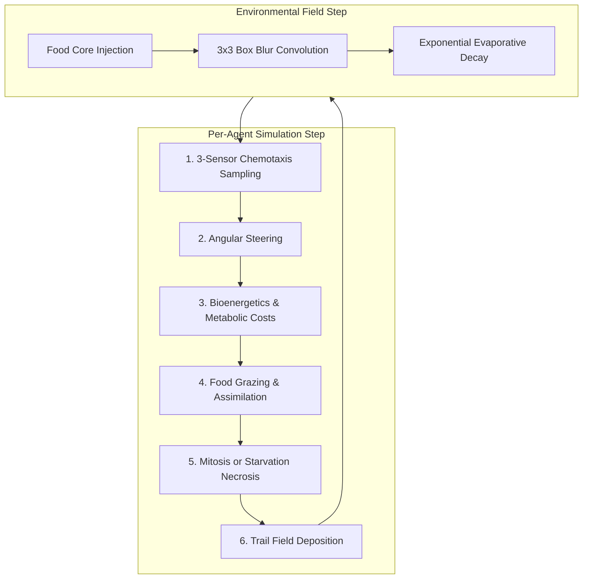

# Slime Mold Simulation: Mathematics and Mechanics

This document details the mathematical models, algorithmic mechanisms, and bioenergetic principles underlying the *Physarum polycephalum* simulation in `MOLD`.

---

## 1. Introduction & Conceptual Model

The simulation is based on the agent-based multi-agent transport network model introduced by **Jeff Jones (2010)**, augmented with an explicit metabolic energy budget (bioenergetics) and finite nutrient grazing dynamics.

The system consists of two coupled layers:
1. **Continuous Agent Population:** Up to $N = 25{,}000$ discrete mobile particles with floating-point coordinates $(x, y)$, heading angle $\theta \in [0, 2\pi)$, and internal stored energy $E \ge 0$.
2. **Chemoattractant Trail Field:** A discrete 2D scalar grid $T(x, y) \in [0, 255]$ of resolution $420 \times 420$ with toroidal boundary conditions (wrap-around topology) representing both slime trail secretions and food odor gradients.



---

## 2. Chemotactic Navigation & Sensory Geometry

Each agent senses its environment using three forward-projected virtual sensors positioned at distance $d_s$ (`sensorDist`) and angular offset $\phi_s$ (`sensorAngle`):

$$\begin{aligned}
\mathbf{p}_{\text{forward}} &= \left( x + d_s \cos(\theta), \; y + d_s \sin(\theta) \right) \\
\mathbf{p}_{\text{left}} &= \left( x + d_s \cos(\theta - \phi_s), \; y + d_s \sin(\theta - \phi_s) \right) \\
\mathbf{p}_{\text{right}} &= \left( x + d_s \cos(\theta + \phi_s), \; y + d_s \sin(\theta + \phi_s) \right)
\end{aligned}$$

```
                p_left
                 \
                  \  phi_s
                   \
  Agent (x,y) ------> p_forward
                   /
                  /  phi_s
                 /
                p_right
```

### Bilinear Trail Field Interpolation

Because sensor locations are continuous real coordinates on a discrete grid, the trail intensity $T(\mathbf{p})$ is sampled using bilinear interpolation:

Let $\tilde{x} = x \bmod W$, $\tilde{y} = y \bmod H$, with integer components $x_0 = \lfloor\tilde{x}\rfloor$, $y_0 = \lfloor\tilde{y}\rfloor$ and fractional components $f_x = \tilde{x} - x_0$, $f_y = \tilde{y} - y_0$:

$$x_1 = (x_0 + 1) \bmod W, \quad y_1 = (y_0 + 1) \bmod H$$

$$\begin{aligned}
T_{\text{top}} &= T(x_0, y_0)(1 - f_x) + T(x_1, y_0) f_x \\
T_{\text{bottom}} &= T(x_0, y_1)(1 - f_x) + T(x_1, y_1) f_x \\
T(\mathbf{p}) &= T_{\text{top}}(1 - f_y) + T_{\text{bottom}} f_y
\end{aligned}$$

### Steering Decision Rules

Let $S_F = T(\mathbf{p}_{\text{forward}})$, $S_L = T(\mathbf{p}_{\text{left}})$, and $S_R = T(\mathbf{p}_{\text{right}})$. The agent updates its heading $\theta$ using turn angle $\phi_t$ (`turnAngle` $\approx 22^\circ$):

- **Forward Dominant** ($S_F > S_L$ and $S_F > S_R$): Continue straight with slight brownian jitter: $\theta \leftarrow \theta + \mathcal{U}(-0.04, 0.04)$.
- **Left Dominant** ($S_L > S_R$): Steer counter-clockwise: $\theta \leftarrow \theta - \phi_t + \mathcal{U}(-0.03, 0.03)$.
- **Right Dominant** ($S_R > S_L$): Steer clockwise: $\theta \leftarrow \theta + \phi_t + \mathcal{U}(-0.03, 0.03)$.
- **Indifferent / Flat Field** ($S_F = S_L = S_R$): Random wander: $\theta \leftarrow \theta + \mathcal{U}(-0.4, 0.4)$.
- **Hunger Jitter:** If internal energy $E < 28.0$, agents enter exploratory search mode by injecting additional angular noise: $\theta \leftarrow \theta + \mathcal{U}(-0.35, 0.35)$.

---

## 3. Bioenergetics & Population Dynamics

Rather than assuming immortal agents, each agent maintains an internal energy state $E$:

### Metabolic Expenditure

During each step $\Delta t$, the agent expends energy through two mechanisms:

1. **Basal Metabolic Rate (BMR):** Static survival cost:
   $$\Delta E_{\text{BMR}} = -\text{BMR}$$
2. **Locomotion Exploration Cost:** Moving through uncolonized territory costs more energy than moving through established network veins:
   $$C_{\text{territory}} = \max\left(0.25, \; 1.0 - \frac{T(x, y)}{80.0}\right)$$
   $$\Delta E_{\text{loco}} = -\text{locomotionCost} \cdot C_{\text{territory}}$$

### Food Ingestion & Assimilation

When an agent moves inside the radius $r$ of a food nodule $k$ ($|\mathbf{x} - \mathbf{x}_k| \le r_k$):
- It consumes a fraction of nutrients: $\Delta N = \text{grazingRate} = 0.015$.
- Its internal energy increases via assimilation yield $\eta = 8.0$:
  $$E \leftarrow E + \Delta N \cdot \eta$$

### Starvation Necrosis & Mitosis

- **Necrosis:** If $E \le 0$, the agent dies and is instantly recycled from the population (compacting the active agent array in $O(1)$ time).
- **Mitosis (Cell Division):** If $E \ge \theta_{\text{mitosis}}$ ($75.0$) and total population $N < N_{\max}$, the agent divides:
  - Parent energy halves: $E \leftarrow E \times 0.48$.
  - A daughter agent is spawned with energy $E$ at $\mathbf{x} + \boldsymbol{\epsilon}$, with small heading perturbation $\theta + \mathcal{U}(-1.0, 1.0)$.

### Trail Deposition

Living agents secrete chemoattractant at their new position $\mathbf{x}_{\text{new}}$:
$$T(\mathbf{x}_{\text{new}}) \leftarrow \min(255.0, \; T(\mathbf{x}_{\text{new}}) + \delta_{\text{deposit}})$$

---

## 4. Trail Field Diffusion & Evaporation

The continuous slime trail field undergoes spatial diffusion and exponential evaporation:

### Food Chemoattractant Core Injection

Food nodules actively inject chemoattractant proportional to their remaining nutrient ratio:
$$T(\mathbf{p}) \leftarrow \min\left(255.0, \; T(\mathbf{p}) + 36.0 \cdot \frac{N_{\text{current}}}{N_{\text{initial}}}\right) \quad \forall |\mathbf{p} - \mathbf{x}_{\text{nodule}}| \le r$$

### Spatial 2D Box Convolution & Decay

For each cell $(x, y)$, the 8 Moore neighbors are averaged to approximate discrete 2D spatial diffusion:

$$\bar{T}(x, y) = \frac{1}{8} \sum_{\Delta x \in \{-1,0,1\}} \sum_{\Delta y \in \{-1,0,1\} \setminus (0,0)} T(x + \Delta x, y + \Delta y)$$

The new field value combines the current value, diffusion blend $d = 0.45$, and evaporative decay $\lambda = 0.965$:

$$T_{t+1}(x, y) = \left[ (1 - d) T_t(x, y) + d \, \bar{T}(x, y) \right] \cdot \lambda$$

A low-pass dead-zone cutoff ($T < 0.15 \implies T = 0$) prevents floating-point subnormal numbers and cleans up dead trails.

---

## 5. Food Nodule Shrinking & Depletion

Food nodules act as finite resource reservoirs:
- **Radius Decay Equation:** As nutrients $N$ deplete from initial capacity $N_0$, the physical radius shrinks non-linearly:
  $$r = \max\left(2.5, \; r_{\max} \cdot \left(\frac{N}{N_0}\right)^{0.65}\right)$$
- **Quenching:** When $N \le 0$ or $r \le 2.5$, the nodule is consumed and removed from the active voice list. Surrounding trail attractant is multiplied by $0.25$ over radius $1.5 \cdot r_{\max}$ to simulate foraging network retraction.

---

## 6. Visualization & Zorn Palette Color Mapping

The pixel rendering pass in `Render.pde` translates continuous field values into discrete cellular structures inspired by the historical Zorn palette (Yellow Ochre, Vermilion Red, Flake White, Ivory Black):

### Slime Network Density Thresholds

| Trail Value $T$ | Biological Feature | Zorn Palette Representation |
|:---|:---|:---|
| $T < 0.8$ | Empty Petri Substrate | Ivory Black `#06070A` |
| $0.8 \le T < 4.0$ | Atrophied / Faint Exploration Veins | Dark Ochre `#734108` |
| $4.0 \le T < 10.0$ | Active Migration Margin | Medium Ochre `#A16207` |
| $10.0 \le T < 30.0$ | Plasmodial Sheet | Vibrant Yellow `#EAB308` |
| $T \ge 30.0$ | Major Cytoplasmic Artery | Bright Artery `#FEF08A` |

### Food Nodule Feedback

1. **Idle State:** Soft Flake White (`#F5F5F0`).
2. **Grazing State:** When contacted by slime mold, the nodule envelope (`consumptionActivity`) smooths up, shifting the core color to Vermilion Red (`#E34234`).
3. **Depletion Fade:** As the remaining nutrient ratio $\rho = N / N_0$ drops, the active color transitions from Vermilion Red back to Yellow Ochre (`#EAB308`):
   $$C_{\text{active}} = \text{lerpColor}(\text{Yellow}, \text{Red}, \rho)$$
   $$C_{\text{final}} = \text{lerpColor}(\text{White}, C_{\text{active}}, \text{activity})$$

---

## 7. Parameter Reference

| Parameter | Variable | Default | Range | Description |
|:---|:---|:---|:---|:---|
| Simulation Speed | `simSpeed` | `0.40` | `0.05 – 2.00` | Sub-step accumulator multiplier |
| Sensor Distance | `sensorDist` | `16.0 px` | `6.0 – 45.0` | Lookahead distance for 3-sensor chemotaxis |
| Sensor Angle | `sensorAngle` | `35.0°` | Fixed | Angular spread of left/right sensors |
| Turn Angle | `turnAngle` | `22.0°` | Fixed | Heading change upon lateral gradient detection |
| Trail Decay | `trailDecay` | `0.965` | Fixed | Multiplier per time step (evaporative decay) |
| Trail Diffusion | `trailDiffuse` | `0.45` | Fixed | Blending factor with 8-neighbor average |
| Basal Metabolism | `bmr` | `0.010` | `0.001 – 0.050` | Constant energy loss per step |
| Locomotion Cost | `locomotionCost` | `0.018` | `0.002 – 0.080` | Terrain penalty when traversing new areas |
| Mitosis Threshold | `mitosisThreshold` | `75.0` | Fixed | Stored energy required for cell division |
| Assimilation Yield | `assimilationYield`| `8.0` | Fixed | Energy gained per unit of nutrient ingested |
